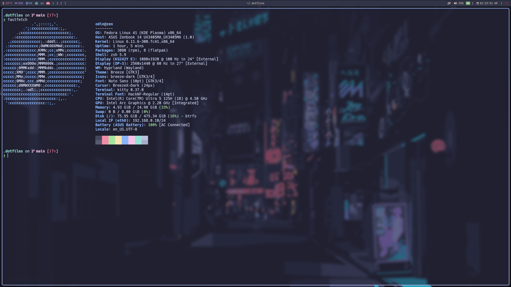

# dotfiles
---
- Laptop: Asus Zenbook 14
- OS: Fedora
- Editor: neovim
- Terminal: kitty
- Shell: zsh
- Tiling Compositor: hyprland
- Alternate Desktop Environment: KDE Plasma
- Color Theme: catppuccin mocha (mainly)

---

