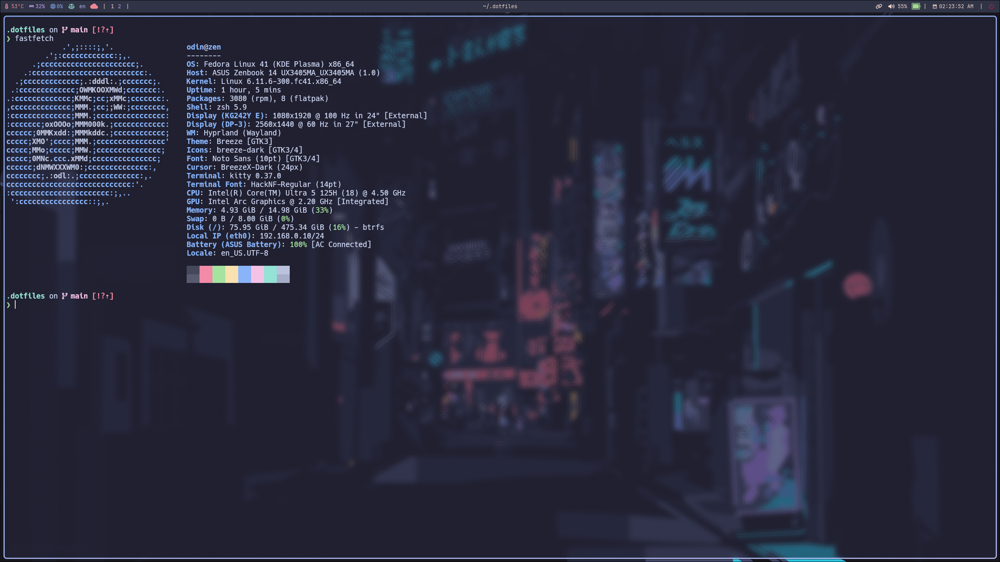

# Dotfiles for self

All of my configuration files reside here. 
Please, note that this is specific to my system and needs, therefore,
if you try to use this repository directly, some functionality
may not work properly. Feel free to use my configuration as the
base or inspiration for your own personalized workflow.

---

## System Overview

- **Laptop**: _Asus Zenbook 14_
- **OS**: _Arch Linux_
- **Editor**: _neovim_
- **Terminal**: _ghostty_
- **Shell**: _bash_
- **Window Manager**: _hyprland_
- **Color Theme**: _nord, gruvbox_

---

## Future Plans
I aim to seamlessly configure my Linux systems without too much hustle.
Main goal is to automate OS installation so that it will be ready
to use on any given machine.

### TODO
- ~~Theme Switching (nord & gruvbox)~~
- Convenient Docking
- Automatic System Configuration